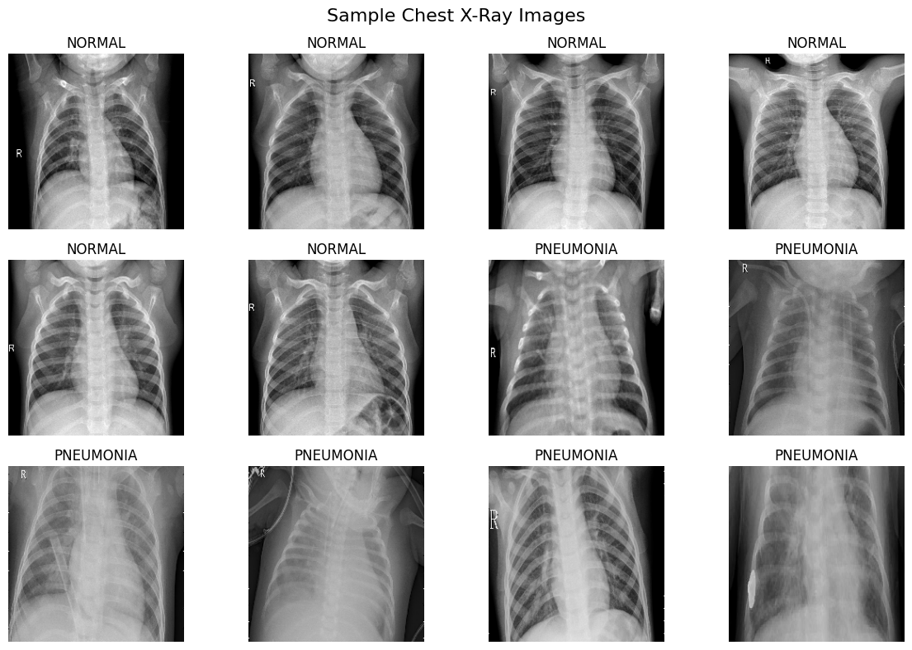
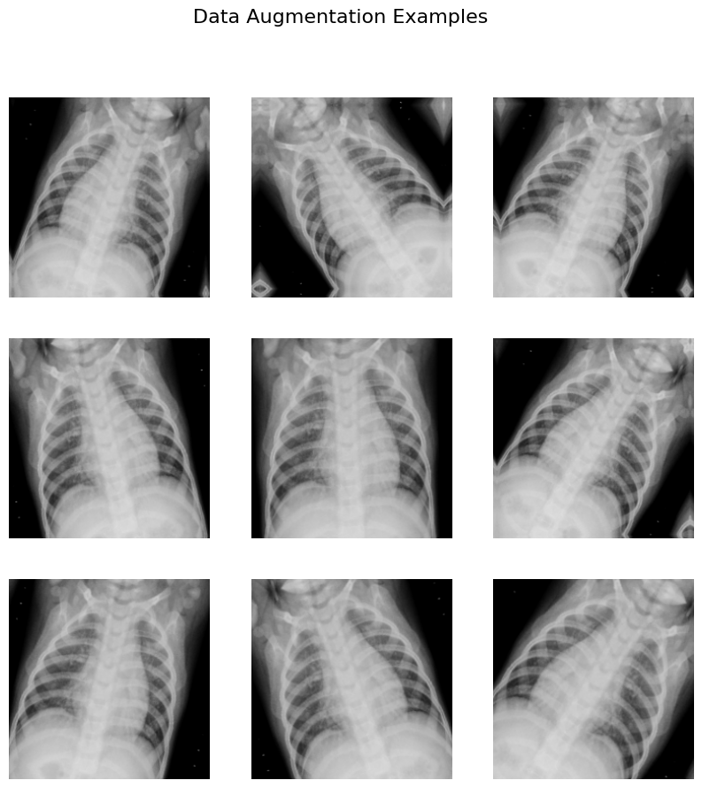
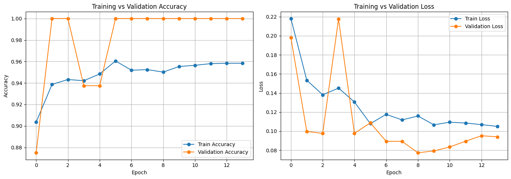
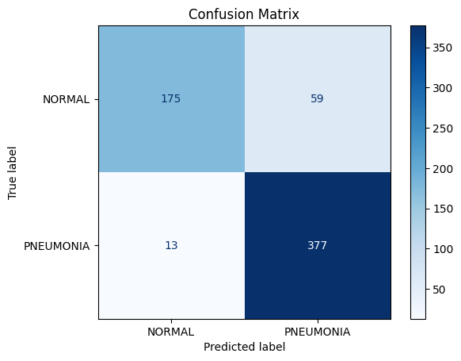
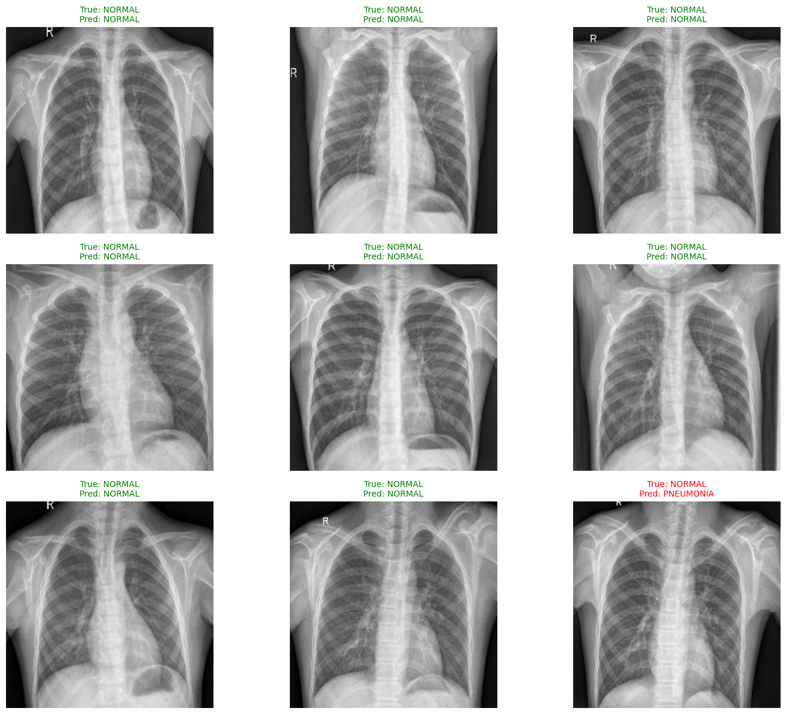
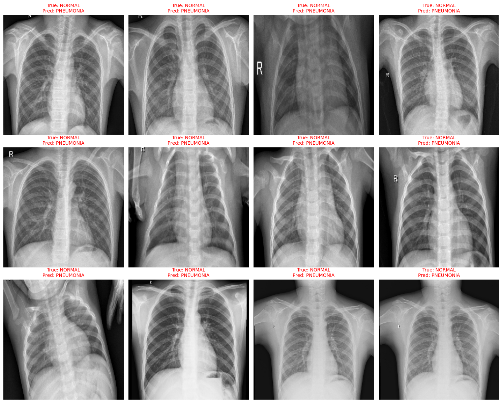
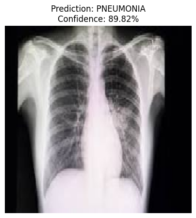

# 🫁 Pneumonia Detection using EfficientNetB0


A Deep Learning project for detecting **Pneumonia** from **Chest X-ray images** using **Transfer Learning** with **EfficientNetB0**.

---

# 📌 Project Overview

Pneumonia is a lung infection that can be diagnosed from Chest X-ray images. This project leverages **Transfer Learning** with **EfficientNetB0** to automatically classify Chest X-rays into:

- 🟢 NORMAL
- 🔴 PNEUMONIA

The project covers the complete Deep Learning workflow, including preprocessing, data augmentation, model training, evaluation, error analysis, and custom image prediction.

---

# 📂 Dataset

The project uses the **Chest X-ray Pneumonia Dataset**.

Dataset structure:

```
train/
    NORMAL/
    PNEUMONIA/

val/
    NORMAL/
    PNEUMONIA/

test/
    NORMAL/
    PNEUMONIA/
```

| Split | Images |
|-------|--------:|
| Train | 5,216 |
| Validation | 16 |
| Test | 624 |

---

# 🖼️ Sample Chest X-ray Images



---

# 🔄 Data Augmentation

To improve generalization and reduce overfitting, the following augmentation techniques were applied:

- Random Flip
- Random Rotation
- Random Zoom
- Random Contrast

### Augmented Samples



---

# 🧠 Model Architecture

The model is based on **EfficientNetB0** pre-trained on ImageNet.

Architecture:

- EfficientNetB0 (Frozen)
- GlobalAveragePooling2D
- Dropout (0.3)
- Dense (128, ReLU)
- Dense (1, Sigmoid)

---

# ⚙️ Technologies Used

- Python
- TensorFlow
- Keras
- NumPy
- Matplotlib
- Scikit-learn
- OpenCV

---

# 📊 Model Performance

## Test Results

| Metric | Value |
|---------|------:|
| Test Accuracy | **88.46%** |
| Test Loss | **0.2852** |

### Classification Report

| Class | Precision | Recall | F1-score |
|--------|----------:|-------:|---------:|
| NORMAL | 0.93 | 0.75 | 0.83 |
| PNEUMONIA | 0.86 | 0.97 | 0.91 |

---

# 📈 Training Curves

The following graph shows the training and validation accuracy/loss during training.



---

# 📉 Confusion Matrix



---

# 🔍 Sample Predictions

The model correctly classified most Chest X-ray images.



---

# ❌ Wrong Predictions

Some Chest X-rays contain subtle or ambiguous visual patterns, making them difficult to classify correctly.

Analyzing these cases helps identify model limitations and provides opportunities for future improvements.



---

# 🩺 Custom Image Prediction

The trained model can classify unseen Chest X-ray images.

Example:

```
Prediction : PNEUMONIA
Confidence : 97.84%
```



---

# 🚀 Future Improvements

- Fine-Tune EfficientNetB0
- Add Grad-CAM for model explainability
- Improve Normal class recall
- Hyperparameter tuning
- Deploy using Streamlit

---

# ▶️ How to Run

Clone the repository:

```bash
git clone https://github.com/YourUsername/Pneumonia-Detection-EfficientNetB0.git
```

Install dependencies:

```bash
pip install -r requirements.txt
```

Run the notebook:

```bash
jupyter notebook
```

---

# 📁 Project Structure

```
Pneumonia-Detection-EfficientNetB0/
│
├── notebook.ipynb
├── Pneumonia_Detection_EfficientNetB0.keras
├── README.md
├── requirements.txt
├── app.py
│
├── images/
│   ├── sample_chest_x_ray_images.png
│   ├── data_augmentation_examples.png
│   ├── accuracy&loss_graph.png
│   ├── confusion_matrix.png
│   ├── some_predictions.png
│   ├── some_wrong_predictions.png
│   └── custom_image_prediction.png
│
└── LICENSE
```

---

# ⭐ Key Features

- ✅ Transfer Learning using EfficientNetB0
- ✅ Data Augmentation
- ✅ Chest X-ray Binary Classification
- ✅ Model Evaluation
- ✅ Classification Report
- ✅ Confusion Matrix
- ✅ Sample Predictions
- ✅ Error Analysis
- ✅ Custom Image Prediction

---

# 👩‍💻 Author

**Safa**

